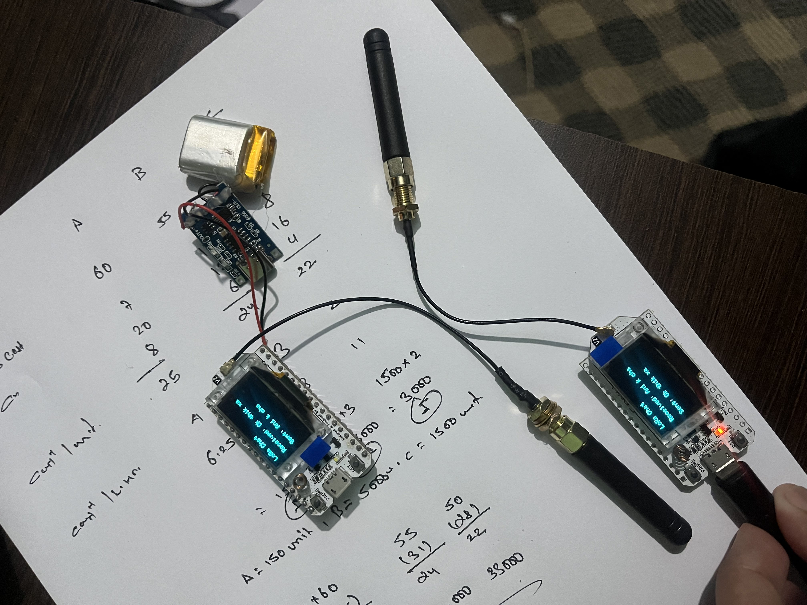
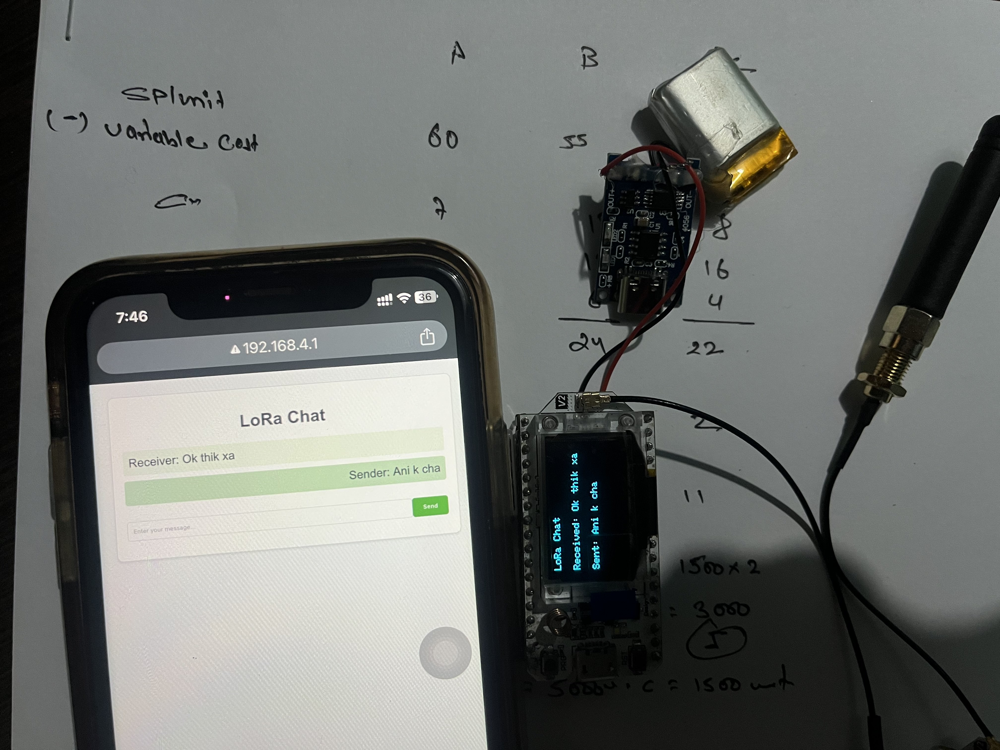

# LoRa Chat with Web Interface

## Overview
This project enables wireless communication between devices using LoRa technology and provides a user-friendly web interface for sending and receiving messages. It creates a WiFi access point to host a simple web server for message transmission. The system is built using an ESP32-based Heltec LoRa32 V2/V3 development board.




## Features
- **LoRa-Based Communication**: Send and receive messages over long distances using LoRa technology.
- **Web Interface for Chat**: Access a chat interface through a WiFi access point to send messages.
- **Real-Time Display**: An OLED screen displays received and sent messages.
- **Customizable Web Server**: View received messages and send new ones via a dynamic HTML interface.



## Components
- **Heltec LoRa32 V2/V3**
- **Adafruit SSD1306 OLED Display (128x64)**
- **WiFi Module (Integrated in ESP32)**

## Pin Configuration
| Pin | Function         |
|-----|-----------------|
| 5   | SCK             |
| 19  | MISO            |
| 27  | MOSI            |
| 18  | SS (LoRa CS)    |
| 14  | RST             |
| 26  | DI0 (IRQ)       |
| 4   | SDA (OLED I2C)  |
| 15  | SCL (OLED I2C)  |

## Libraries Used
- `SPI.h` for SPI communication
- `LoRa.h` for LoRa module
- `Wire.h` for I2C communication
- `Adafruit_GFX.h` and `Adafruit_SSD1306.h` for OLED display
- `WiFi.h` for hosting the web server

## Setup Instructions
1. **Install Libraries**: Ensure the required libraries are installed in your Arduino IDE:
   - `LoRa` library by Sandeep Mistry
   - `Adafruit GFX` and `Adafruit SSD1306`
2. **Hardware Connections**:
   - Connect the LoRa module and OLED display as per the pin configuration above.
3. **Upload Code**:
   - Use the Arduino IDE to upload the provided code to your Heltec LoRa32 V2/V3.

## Usage
1. Power up the device.
2. Connect to the WiFi access point:
   - **SSID**: `LoRaChat_AP`
   - **Password**: `12345678`
3. Open a web browser and navigate to the IP address displayed on the OLED screen.
4. Use the web interface to send and receive messages:
   - Messages are sent over LoRa to another device running the same code.
   - Incoming messages are displayed both on the OLED and in the web interface.

## Web Interface
- The web interface provides an input box to send messages and displays incoming messages dynamically.
- Messages are color-coded: sent messages appear on the right, and received messages on the left.

## Example URL for Sending Messages
```
http://<IP_ADDRESS>/send?message=Hello%20LoRa
```
Replace `<IP_ADDRESS>` with the device's IP displayed on the OLED screen.

## Customizations
- **Frequency**: Change the LoRa frequency by modifying `#define BAND` to match your region (e.g., 868E6 for Europe).
- **WiFi Credentials**: Modify `ssid` and `password` for different network settings.

## Troubleshooting
- **OLED Not Displaying**: Check I2C connections and ensure the correct address (0x3C) is used.
- **LoRa Initialization Fails**: Verify SPI connections and the correct frequency.
- **WiFi Issues**: Ensure your ESP32 is properly configured as an access point.


## License
This project is licensed under the MIT License.

## Contributions
Pull requests and improvements are welcome! For major changes, please open an issue first to discuss what you would like to change.

---

Happy chatting with LoRa!

